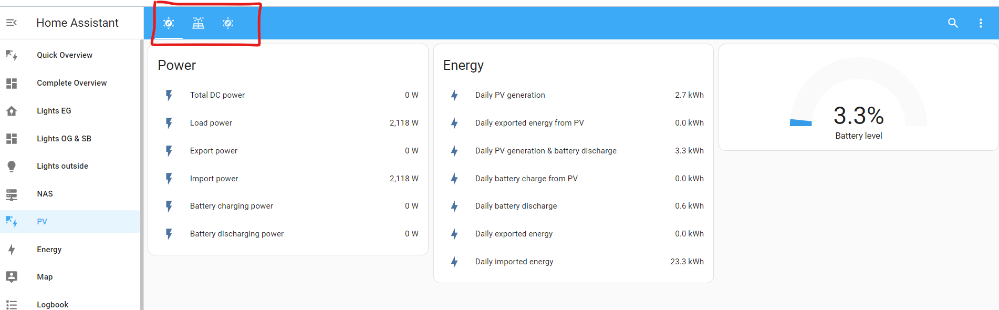

An *easy-to-use YAML-based integration* for several Sungrow inverters for Home Assistant. 

[](https://discord.gg/ZvYBejFkm2)

# IMPORTANT (2023-08-21): Errors in YAML file - fixed!
In the last Home Assistant update (2023.8.3), some breaking changes have been made to the internal HA Modbus implementation. This causes that this yaml-integration won't start. 
This was fixed in the current revision. Please upgrade. 

**Update 2023-08-25:** Home Assistant **2023.8.4** works with the current code, too!

# Note (July 2023)
I made a mistake end of march causing unique_ids of sensors getting mixed up. This is now fixed, but it may affect you. You are affected, if you see these warnings in a current verison of the Standard PV dashboard:
> entity not available: sensor.sg_battery_charge_nom and sg_battery_level_nom"

 Follow these instructions to fix it: https://github.com/mkaiser/Sungrow-SHx-Inverter-Modbus-Home-Assistant/issues/88#issuecomment-1625270593

# Contents
- [1. Overview](#1-overview)
- [2. Documentation](#2-documentation)
    - [Installation/ Configuration](doc/installation.md)
    - [Dashboard Setup](doc/dashboard.md)
    - [Usage Instructions](doc/usage.md)
    - [FAQ, Troubleshooting, Known Issues](doc/help.md)
    - [Roadmap](doc/issues_roadmap.md)
- [3. Support](#3-support)
- [4. Visual impressions](#4-visual-impressions)
- [5. Tested configurations](#5-tested-configurations)
- [6. Status and future work](#6-status-and-future-work)
- [7. Most important of all](#7-most-important-of-all)


# 1. Overview

This integration lets you gather sensor data and control the EMS (Energy Management System) of a wide range of Sungrow inverters, including, but not limited to: SH3.6RS, SH4.6RS, SH5.0RS, SH5.0RT, SH6.0RS, SH8.0RT, SH8.0RT-V112, SH6.0RT, SH10RT, SH10RT-V112, SH5K-20, SH3K6, SH4K6, SH5K-V13, SH5K-30. A battery is not required, but several sensors will not be available without one.

Ensure, that you connected the inverter to the Home Assistant network using the native LAN port. The WiNet Ethernet port is not only partially working!


## 2. Documentation

The documentation covers following topics:

[Installation/ Configuration](doc/installation.md)

[Dashboard Setup](doc/dashboard.md)

[Usage Instructions](doc/usage.md)

[FAQ, Troubleshooting, Known Issues](doc/help.md)

## 3. Support

If you any kind of assistance, you have three options:

a) Use the [github discussion](../../discussions) 

b) (new! Created in July 2023) Join the Discord Channel [](https://discord.gg/ZvYBejFkm2).

c) Only if code-related (bugs / contributions): Open an  [github issue](../../issue) or isse a pullrequest

## 4. Visual impressions

Home Asisstants built-in Energy Dashboard


Default dashboard tab "overview"




Default dashboard tab "Detail"


Default dashboard tab "EMS"


## 5. Tested configurations
I have a **Sungrow SH10.RT** Inverter and a **PylonTech Force H1 battery with 14.4 kWh** updating frequently to the latest **Home Assistant** (> 2023.3). I try to thoroughly test features before releasing them, but I cannot test everything (e.g., backup capabilities, DO-related, ...)

The Modbus register mapping is based on two documents the Sungrow support sent me (my current version is v1.0.25 from 12.01.2023. The changelogs from .23 to .25 only mention added device codes (*RT-20, *-V112 and *-V122). I am not sure if I am allowed to share the files, but you can search for them using their names. Let me know in the [github discussions](https://github.com/mkaiser/Sungrow-SHx-Inverter-Modbus-Home-Assistant/discussions), if there are newer versions available.

```
Communication.Protocol.of.Residential.Hybrid.Inverter_V1.0.23_EN
10.4 Communication Protocol_String Inverter_V1.1.36_EN.pdf
```

Please let me know if the integration also works with other Sungrow models. 

Community-confirmed supported inverters (thank you for reporting!)
- SH10RT (via home assistant community, brix29 Axel)
- SH10RT-V112 (github, dzarth, ViktorReinhold)
- SH5.0RT(home assistant community, ptC7H12 Paul)
- SH8.0RT (github, lindehoff)
- SH5K-30 (github, ajbatchelor)

partially working
- SH5.RS (home assistant community, Danirb80) via WiNetS: register running_state is not available. Created workarounds using template sensors

## 6. Status and future work 
1. See [#38](https://github.com/mkaiser/Sungrow-SHx-Inverter-Modbus-Home-Assistant/issues/38) for some kind of a roadmap
2. I included the registers, which are common between a wide range of Sungrow inverter models. There are many more registers in the Sungrow documents, which I left out, but I am happy to include them, if you need them. --> [github discussions](../../discussions)
3. If you made a nice visualization - let us know! --> [github discussions](../../discussions)
4. This is meant to be a simple, straightforward YAML-based integration. If you need more than this, I recommend having a look at the SunGather project: https://github.com/bohdan-s

## 7. Most important of all
We am happy to share our experiences - feel encouraged to share yours with us, too! Participate, if you have any questions :)

**Thanks to all the people, who are actively contributing to this project! Special thanks to Louis712, dylan09 and elektrinis, who are helping a lot helping others in the issue/ disussion sections!**
