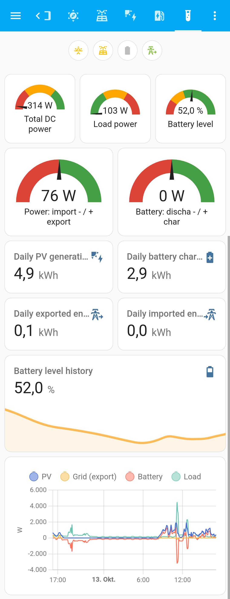
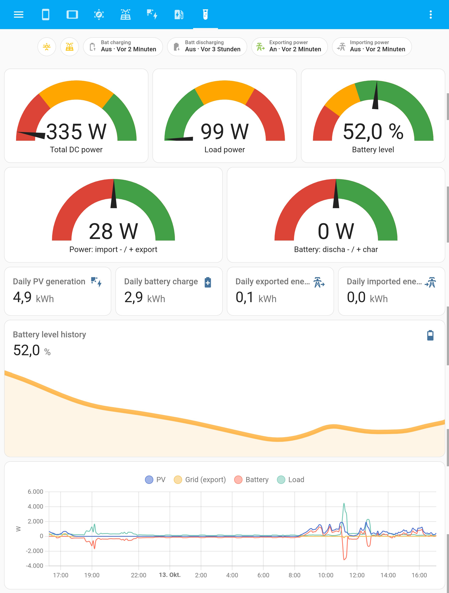
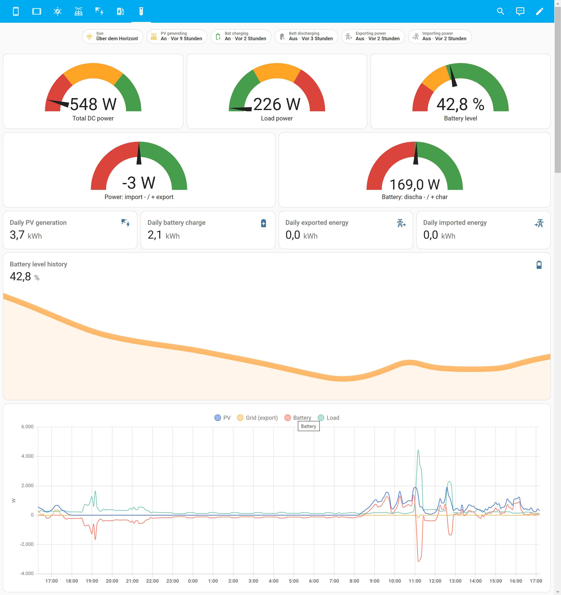

# Quick Overview

## Description

The new Overview makes use of some improvements to the Badges in Home Assistant. It uses the visibility function to show and hide the Badges depending on their state. It also make adjustments depending on the screen width to some elements. 
No need to switch between Mobile (portrait) and Desktop (landscape) Mode anymore :-)

## Screenshots

### Mobile View

### Tablet View

### Desktop View

## Installation

1. Go to your PV Dashboard and click the Pencil in the top right corner
2. Add a new View by clicking the + in the Tab row
3. Click the three dots in the top right corner and switch to YAML Editor
4. Paste the contents of the [responsive.yml](responsive.yml) file from this folder
5. Save changes with the link on bottom right
6. Move the new Tab to the left with the arrows
7. Finish editing mode with the button top right
8. Enjoy your new Quick Overview whenerver you enter the PV Dashboard