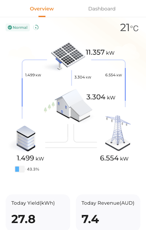
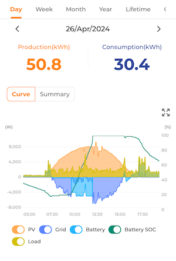
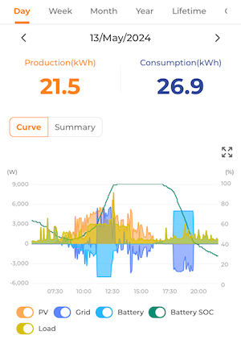
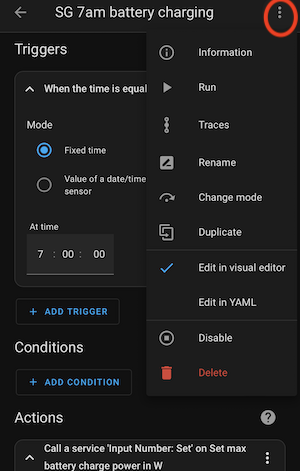
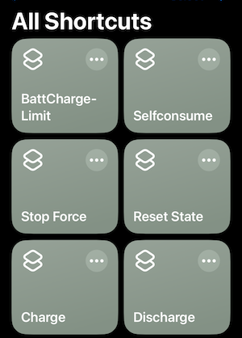
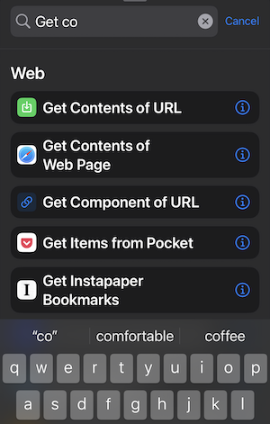
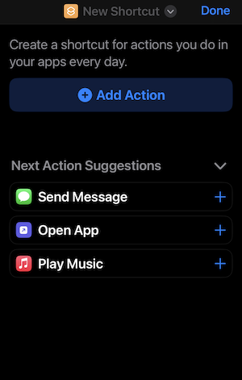
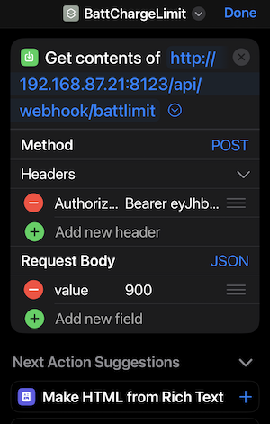
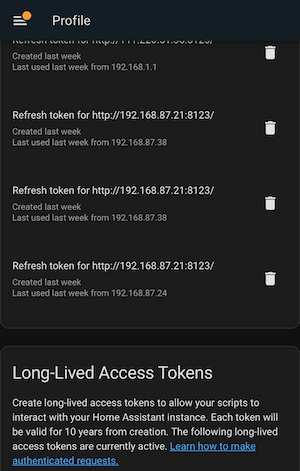

This repository contains collections of Sungrow Solar and Battery Automation (Step Charging) using Home Assistant modbus protocol and Iphone Shortcuts by Roger Lee (https://github.com/rcmlee99).




# Step Charging by using Battery Charging Limit


# Force Charging and Discharging


# Prerequisite

Some basic knowledge of router networking and yaml configuration are required.

## Home Assistant (HA)

You need a working Home Assistant server running at your home.

### Recommendation

If you do not have one HA yet, I highly recommend you getting a Raspberry Pi 4 Model B. You can buy one from Aliexpress with 4Gb RAM and 64Gb SDCard (https://www.aliexpress.com/item/4000066043319.html). This packages comes with power supply, mini HDMI cable, heat sink and fan.

Install the HA using the instructions at https://www.home-assistant.io/installation/raspberrypi. Start the HA and goto http://X.X.X.X:8123 (replace X.X.X.X with your Raspberry Pi’s IP address) which will be shown on the screen.

## Visual Studio Code

In your HA, goto Settings -> Add On Store. Search for Studio Code Server and choose install.

## Modbus Protocol

Follow the instructions in github repository https://github.com/mkaiser/Sungrow-SHx-Inverter-Modbus-Home-Assistant/blob/main/doc/installation.md, copy the the following two files in the correct folder.

1. modbus_sungrow.yaml
2. secrets.yaml

Modify the configuration.yaml and add these two lines :

```jsx
homeassistant:
  packages: !include_dir_named integrations
```

# Automations

To create new automation triggers, goto Settings -> Automations & Scenes then click Create Automation. On the top right corner, click on the 3 dots and select edit in YAML.



Below are some of the automations scripts I am running. 
Copy and paste into editor. Change the data value and triggers as needed.

## Battery Limit Charging

```jsx
alias: SG 7am battery charging
description: ""
trigger:
  - platform: time
    at: "07:00:00"
condition: []
action:
  - service: input_number.set_value
    data:
      value: 500
    target:
      entity_id: input_number.set_sg_battery_max_charge_power
mode: single

```

```jsx
alias: SG 10am battery charging
description: ""
trigger:
  - platform: time
    at: "10:00:00"
condition: []
action:
  - service: input_number.set_value
    data:
      value: 5000
    target:
      entity_id: input_number.set_sg_battery_max_charge_power
mode: single

```

## Force Charging

```jsx
  alias: Webhook ForceCharge
  description: ""
  trigger:
    - platform: webhook
      allowed_methods:
        - POST
      local_only: true
      webhook_id: charge
    - platform: time
      at: "11:00:00"
      enabled: true
    - platform: time
      at: 02:00:00
      enabled: true
    - platform: time
      at: "20:00:00"
      enabled: false
  condition: []
  action:
    - service: input_select.select_option
      data:
        option: Forced mode
      target:
        entity_id: input_select.set_sg_ems_mode
    - service: input_select.select_option
      data:
        option: Forced charge
      target:
        entity_id: input_select.set_sg_battery_forced_charge_discharge_cmd
  mode: single

```

## Force Discharging

```jsx
alias: Webhook ForceDischarge
description: ""
trigger:
  - platform: webhook
    allowed_methods:
      - POST
    local_only: true
    webhook_id: discharge
  - platform: time
    at: "17:00:00"
  - platform: time
    at: 06:30:00
    enabled: false
condition: []
action:
  - service: input_select.select_option
    data:
      option: Forced mode
    target:
      entity_id: input_select.set_sg_ems_mode
  - service: input_select.select_option
    data:
      option: Forced discharge
    target:
      entity_id: input_select.set_sg_battery_forced_charge_discharge_cmd
mode: single

```

## Self Consume

```jsx
alias: Webhook SelfConsume
description: ""
trigger:
  - platform: webhook
    allowed_methods:
      - POST
    local_only: true
    webhook_id: selfconsume
  - platform: time
    at: "14:00:00"
  - platform: time
    at: 09:30:00
  - platform: time
    at: 03:00:00
    enabled: true
  - platform: time
    at: "19:30:00"
condition: []
action:
  - service: input_select.select_option
    data:
      option: Stop (default)
    target:
      entity_id: input_select.set_sg_battery_forced_charge_discharge_cmd
  - service: input_select.select_option
    data:
      option: Self-consumption mode (default)
    target:
      entity_id: input_select.set_sg_ems_mode
mode: single

```

## Notify Export Power to Mobile App

```jsx
alias: Notify Export Power
description: Export Power
trigger:
  - platform: numeric_state
    entity_id: sensor.export_power
    above: 5000
condition: []
action:
  - service: notify.mobile_app_zee97
    data:
      message: Power {{ states('sensor.export_power') }} W
      title: Export Power
mode: single

```

## Notify Import Power to Mobile App

```jsx
alias: Notify Import Power
description: Import Power
trigger:
  - platform: numeric_state
    entity_id: sensor.import_power
    above: 800
condition: []
action:
  - service: notify.mobile_app_zee97
    data:
      message: Power {{ states('sensor.import_power') }} W
      title: Import Power
mode: single

```

## Notify Battery Discharging Power to Mobile App

```jsx
alias: Battery Discharge Power
description: Battery Discharge W
trigger:
  - platform: numeric_state
    entity_id: sensor.battery_discharging_power
    above: 1500
condition: []
action:
  - service: notify.mobile_app_zee97
    data:
      message: Power {{ states('sensor.battery_discharging_power') }} W
      title: Battery discharge
  - service: script.notify_slack
    data: {}
    enabled: false
mode: single
```

# Iphone Shortcuts

By creating using webhook trigger, I can create collection of iPhone Shortcuts which I can activate using one click or Siri.




## Battery Limit Charging Webhook

```jsx

alias: Webhook Battlimit
  description: ''
  trigger:
  - platform: webhook
    allowed_methods:
    - POST
    local_only: true
    webhook_id: battlimit
  condition: []
  action:
  - service: input_number.set_value
    data:
      value: '{{ trigger.json.value }}'
    target:
      entity_id: input_number.set_sg_battery_max_charge_power
  mode: single

```

In Iphone Shortcuts, create a new actions `Get contents of URL` add the following information :

1. URL: http://Y.Y.Y.Y:8123/api/battlimit (Y.Y.Y.Y is your external IP address). You need to configure HA remote access and port forwarding on your router. See https://www.home-assistant.io/docs/configuration/remote/ and https://community.home-assistant.io/t/home-assistant-remote-access-port-forwarding-on-nest-wifi/300512


2. Method: POST
3. Authorization: Bearer `Your Long-Lived Access Tokens from Profile`. See https://community.home-assistant.io/t/how-to-get-long-lived-access-token/162159

4. Request Body: JSON
5. value: `power limit in W`






# Current home assistant configuration

My current home configuration - Home Assistant Core Version 2023.9.3

1. Goodwe 5kW Inverter GW5000D-NS with 17x390watt JA Panel (6630W)
2. Sungrow 5kW Hybrid Inverter SH5.0RS with 22xTSM-430NEG9R.28 Trina Panel (9460W)
3. Sungrow Battery 16kWh capacity
4. Sungrow Energy Monitor DTSU-666-20
5. Google Home Wifi Model GJ2CQ

# Links

- Modbus Protocol on Mkaiser https://github.com/mkaiser/Sungrow-SHx-Inverter-Modbus-Home-Assistant

- Webhooks & Shortcuts https://www.youtube.com/watch?v=ZXTI286DwYQ&t=633s
