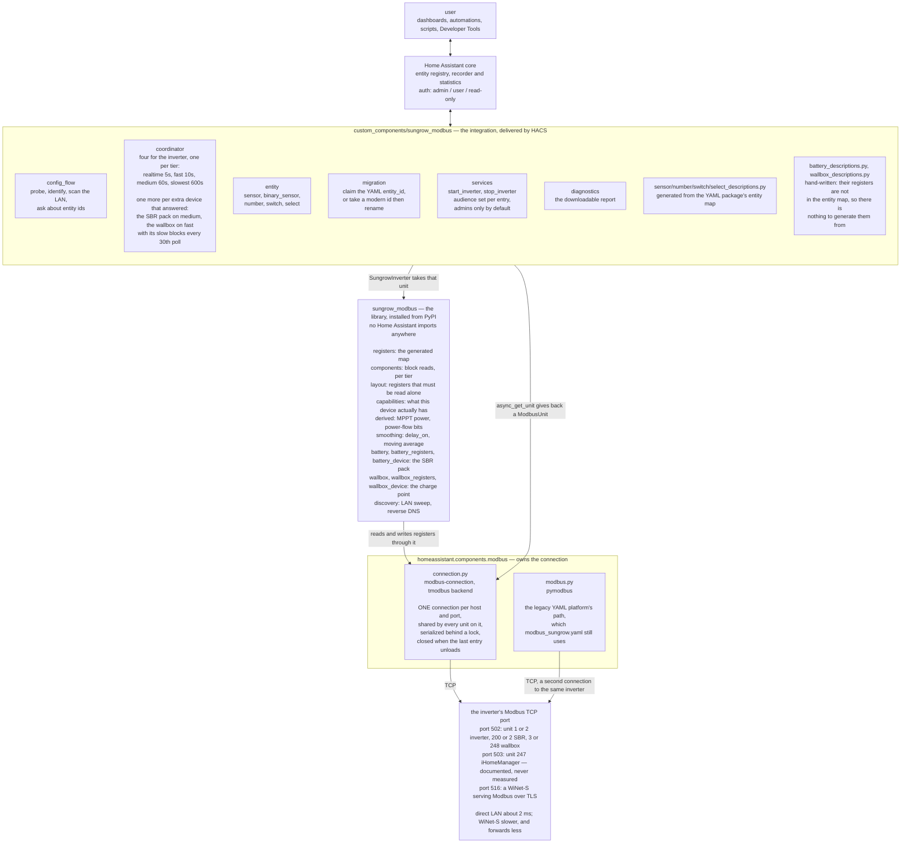
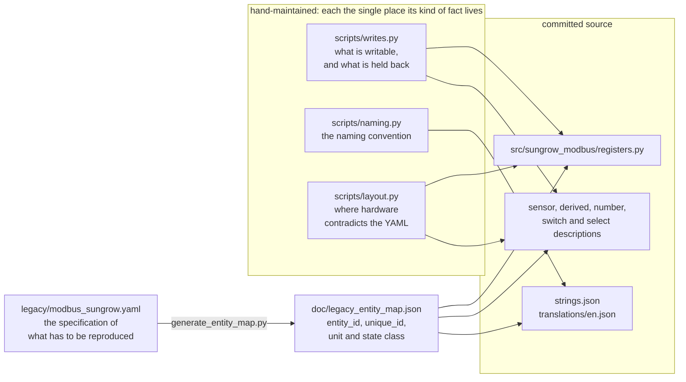

# How the pieces fit together

Six layers, and the interesting thing about them is where the boundaries are
rather than what is in each one. Two of the boundaries are load-bearing:

- **The library owns register knowledge and nothing else.** It never opens a
  socket, never imports Home Assistant, and is testable without either.
- **Home Assistant's own `modbus` integration owns the connection.** One per
  host and port, shared, serialized — which matters because a Sungrow accepts
  very few Modbus sessions at once.

## At runtime

Two backends ship inside core's one `modbus` integration, and the YAML package
rides the other one. That is not a curiosity: it is why running the YAML
package and the integration at the same time produces `Connection lost`
before a response was received, and why the integration says so in the error
rather than leaving people looking at their network.

## Three devices, and why the unit ids are not settings

One endpoint can hold three kinds of device, and **which unit id each answers
on moves with the transport**, so none of them is asked for:

| Device | Unit | Found by |
| --- | --- | --- |
| Inverter | **1**, or **2** for a cluster slave on its own LAN port | `identify()` sweeping 1 to 5. A dongle presents whatever is behind it as unit 1 regardless, so the address is only the role on a direct path |
| SBR pack | **200** direct, **2** through a WiNet-S | `battery.probe_units`, discriminating against a slave inverter — which also sits at 2 and answers a device type code where a pack does not |
| Wallbox | **3** through a WiNet-S, **248** direct | `wallbox.probe_units`, reading the model *name* rather than the code or the serial |

Each extra device gets its **own device registry entry**, hung off the
inverter with `via_device`, identified by the *inverter's* serial plus a
suffix. Neither reports a usable serial of its own: an SBR has none anywhere
in its registers, and a wallbox has one this project deliberately never reads.

A wallbox cannot be found by sweeping for it at all. Measured at the one site
with one: a full /24 found Modbus TCP on two addresses, the inverter and its
dongle, and the wallbox answered only behind the dongle despite having its own
LAN cable.

## What one config entry is

**One endpoint** — a host and a port — plus whatever answered on it. Not one
inverter. That is exactly the set of devices sharing one serialized
connection, which is the only grouping that makes the contention manageable,
and it is why the config flow probes and identifies devices by what answers
rather than by unit id.

## At build time

Most of the committed source is generated from the YAML package, because
transcribing 105 registers by hand produces a mistyped address or a scale off
by ten — a plausible-looking wrong number, which is the failure this project
can least afford.

Every arrow has a `--check` mode that runs in CI **and** in pytest, so a
generated file cannot drift from what it was derived from. Editing one by hand
is undone the next time anybody runs the generator, which is the point.

The three hand-maintained tables are where judgement lives, and each records
why rather than just what: `writes.py` says why a register is exposed or held
back, `naming.py` states the convention a test then enforces, and `layout.py`
carries measurements from real hardware where the YAML turned out to be wrong
about a register's length.

**And two register maps are hand-written, for a reason worth stating.** The
generators derive everything from `doc/legacy_entity_map.json`, which is
generated from `legacy/modbus_sungrow.yaml` — the *inverter's* map. The SBR's
registers are in an opt-in file a user copy-pastes, and the wallbox's are in
no Sungrow document at all. So `battery_registers.py`, `wallbox_registers.py`
and their description modules are written by hand, and get the guard
generation gives everything else from tests instead:

| Hand-written | Checked against |
| --- | --- |
| `battery_registers.py` | `legacy/additional_sensors/modbus_sungrow_SBR_battery.yaml`, address and scale per field — all forty of its sensors |
| `wallbox_registers.py` | the raw words in a committed fingerprint, decoded independently by `probe.py`, field by field |
| `battery_descriptions.py`, `wallbox_descriptions.py` | every `field` resolves to a real field or property; no key collides across devices |

That is the same discipline from the other direction: where a generator
cannot prove a file is right, a measurement does.

## Why the library has no Home Assistant imports

It is a plain Python package on `modbus-connection`, so the register map, the
capability probing, the derived arithmetic and the smoothing all test without
Home Assistant and without an inverter — which is most of the test suite, and
runs in about a second. Core's `sofar` integration is the reference
implementation for this shape.

It also means the library is useful on its own: `scripts/sungrow_scan/probe.py`
drives it directly to fingerprint an installation, with no Home Assistant
anywhere in the process.

The one place time enters is `smoothing.py`, and it takes the clock as an
argument rather than reading one — which is what lets a sixty-second delay be
tested without waiting sixty seconds.
