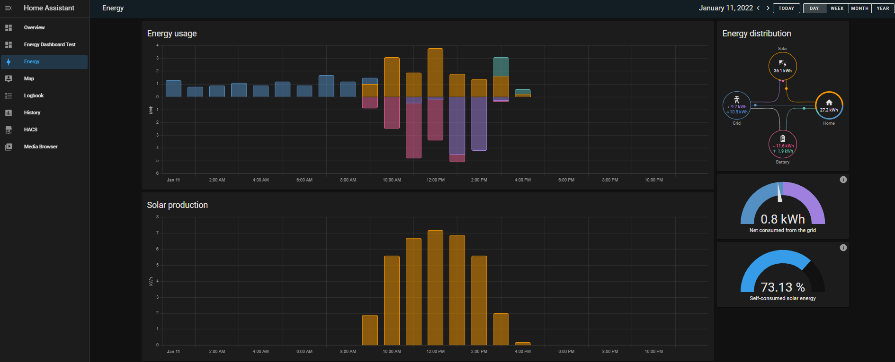
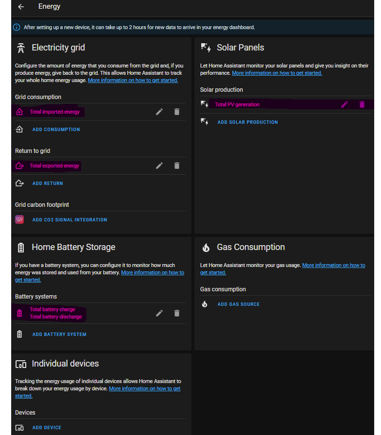

#  Configure dashboards (see screenshots below)
## PV dashboard
Navigate to folder [dashboards/_DefaultDashboard_mkaiser](../dashboards/_DefaultDashboard_mkaiser) and follow the instructions in [README.md](../dashboards/_DefaultDashboard_mkaiser/README.md).

Browse the "dashboards" folder for other contributed dashboards. :)

##  Home Assistant energy dashboard

Open the Energy settings ("Configuration" --> "Energy") and adapt the highlighted values as shown in the screenshot: 

Note, that only the energy in kWh is shown in this dashboard and not the current power (in W).