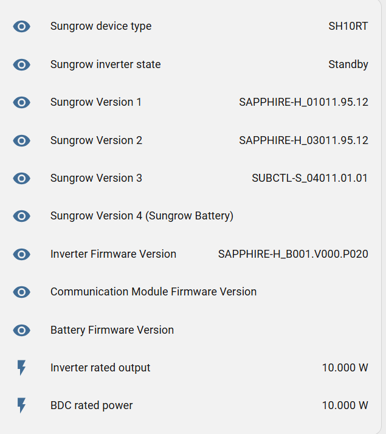
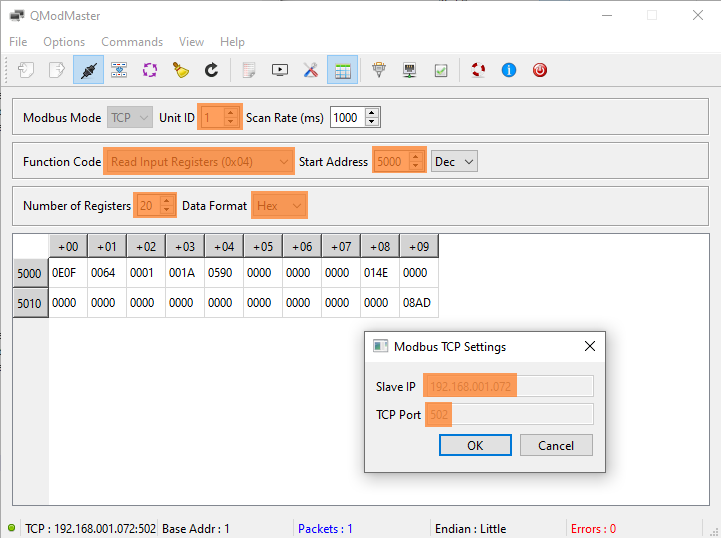

# Frequently Asked Questions (FAQ)

## Contents
- [isolarcloud installer account](#isolarcloud-installer-account)
- [Firmware upgrades](#firmware-upgrades)
- [Firmware version registers](#firmware-version-registers)
- [Properly restart your inverter](#properly-restart-your-inverter)
- [Modbus connection issues](#modbus-connection-issues)
- [Check Home Assistant Log](#check-home-assistant-log)
- [Full list of provided sensors](#full-list-of-provided-sensors)

## isolarcloud installer account

Some advanced settings and firmware upgrades can only be changed remotly using an installer account. See [installer_account.md](installer_account.md) for a step-by-step guide on how to create such an account and link it to your plant.


## Firmware upgrades

### Inverter
Sungrow releases 1-3 firmware updates per year for their inverters. It is generally recommended to keep your inverter firmware up to date to benefit from bug fixes and new features. Unfortunately, Sungrow does not provide a changelog, so upgrading the the newest firmware could result in unexpected behavior with this integration.

You can either upgrade the firmware using the isolarcloud web interface (requires installer account, see above) or by using the isolarcloud mobile app connected directly to the inverter via Wi-Fi or LAN cable.

If you are directly connected to your inverter using the isolarcloud app, use, the administrators credentials are ``` admin / pw8888 ``` (cannot be changed by the user :/ ...). 

## Firmware version registers
Depending on your inverter model and the way it is connected (LAN cable, WiNet-S), the firmware version can be read from different Modbus registers and not all firmware versions might be available. 

| | |
|---|---|
|  |  |
| SH10RT LAN | SH10RT-20 WiNet-S |

### WiNet-S dongle

Help needed as I don't have a WiNet-S :)
- Please submit a PR or create an issue on how to upgrade the firmware

## Properly restart your inverter

Some users reported that the inverter must be completely switched off and only was assigned an IP address after a cold-boot. So do the following:

    1) Turn off the AC power to the inverter
    2) Wait 10 seconds
    3) Switch off the battery (if available)
    4) Wait 10 seconds
    5) Switch off the DC power to the inverter (the large switch at the side of the inverter)
    6) Wait 2 minutes (so all capacitors inside completely discharge)
    7) Perform steps 5 to 1 (in reverse order) to properly boot the inverter, again
    8) After bootup (give it 5 minutes), you should see the inverter's IP address in your LAN router.

## Modbus connection issues

### Advice: Try using a wired/cabled connection

Using the internal LAN port of the inverter is strongly recommended - the WiNet-S dongle is a common source of trouble. Recent Sungrow inverters come with WiNet-S, a dongle for Wi-Fi access / LAN connection, but the software support by Sungrow is still behind the native / internal LAN port. 

###  Instable Modbus connection
Error: The Modbus connection shuts down after some time and doesn‘t reconnect.
Solution: Try installing a Modbus proxy on HomeAssistant.
1. Stop the Modbus connection in HomeAssistant.
    1. If not done already, enable the Advanced Mode.
        1. Login as an admin-user
        2. Go to your profile
        3. Enable the ‘Advanced Mode‘
    2. Disable the Modbus connection in HomeAssistant.
        1. Go to ‘Developer Tools‘
        2. Switch to the tab ‘Services‘
        3. Choose the service ‘modbus.stop‘
        4. For hub, type in ‘SungrowSHx‘
        5. Click on ‘Call Service‘
2. Install the Modbus proxy
    1. Add [this](https://github.com/Akulatraxas/ha-modbusproxy) repository to your HomeAssistant instance.
    2. Install the Add-On ‘modbus-proxy‘ from the Add-On Store
    3. Configure it by adding your Inverter-IP to the ‘upstreamhost‘ field
    4. Save the config and start the Add-On
    5. Change your ‘sungrow_modbus_host_ip‘ in the secrets.yaml file to ‘0‘
3. Restart HomeAssistant


### Directly connect to the inverter using PC tools

Sometimes it is useful to bypass Home assistant and check if a direct modbus connection to the inverter is possible. You can use tools like [QModMaster](https://sourceforge.net/projects/qmodmaster/) (Windows) or [mbpoll](


I tested it with the values shown in the screenshot. First set the TCP settings (Options --> Modbus TCP) then adapt all highlighted parameters.

<figure>
  
  <figcaption>isolarcloud steps 1-3</figcaption>
</figure>

Ensure that the values match the values from your secrets.yaml:

```
Slave IP = sungrow_modbus_host_ip
TCP Port = sungrow_modbus_port
Unit ID = sungrow_modbus_slave
```

**TODO: Write something about mbpoll (linux/WSL)**

## Check Home-Assistant log

Open the Log (Settings --> System --> Logs) and check for error messages related to the Sungrow integration or Modbus connection. Common issues include incorrect IP address, port, or unit ID.

## Full list of provided sensors 

Not all values are displayed in the default dashboard. There is a full list of provided entities in ```debug/sensor_list_for_ha_template_editor.txt```. This list was generated using a python script parsing the ```modbus_sungrow.yaml``` file. 

Copy and paste the sensor list into the Home Assistant Template Editor (Developer Tools --> Template) to see the current values of all sensors provided by this integration.


## How to change EMS modes?

See [usage.md](usage.md) for instructions on how to change the EMS modes using scenes or directly via the entity ```scene.sungrow_ems_mode_<mode>```.