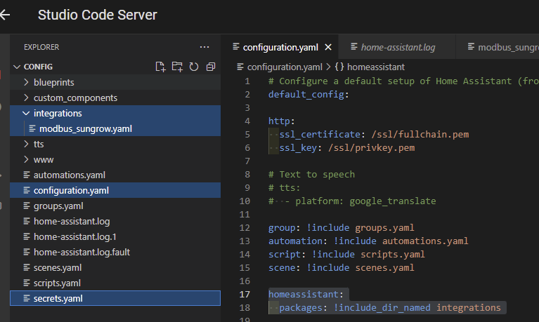

# Installation / Configuration

## Overview 

This does not come as an actual *integration* as per Home Assistance terminology. You can't set it up by clicking something in the Home Assistant web interface.

It is not an "installation" process per se, but more of a "configuration" process. For this, you need to add some information to the Home Assistant configuration files:

Use the Visual Studio Code Server add-on for configuration. In the screenshot, the relevant files for the sungrow integration are highlighted, which you need to modify:

##  Configuration in secrets.yaml
The YAML-based integration file needs 3 parameters as input. Copy the following lines to your secrets.yaml and adapt them:

    sungrow_modbus_host_ip: 192.168.178.xxx # TODO update with the IP of your inverter. No default. Check your router.

    sungrow_modbus_port: 502 # TODO update with the Modbus port of your inverter. Default is '502'
    
    sungrow_modbus_device_address: 1 # TODO update with the unit id / slave address of your inverter. Default is '1'
    
    sungrow_modbus_battery_max_power: 5000 # TODO update with the maximum charge power of your battery in W. 
    # For >99% of all situations setting a lower value than supported does not have measureble disadcantages
    # Keep in mind that high currents put more aging-stress on the battery.
    # Max power of several sungrow batteries: SBR096: 6500W, SBR128: 8500W, SBR160: 10500W, SBR192: 13000W SBR224: 15000Wm SBR256: 17000W
    # Default is 5000 W

##  Modbus register mapping, sensor configuration, automations and scenes
The file **modbus_sungrow.yaml** contains the Modbus register maps, template sensors and automations to set values like the battery minimum SoC. Copy the file to a subfolder named "integrations" (create it if it does not exist), which is located at the same level as your "configurations.yaml" (see screenshot). 

Include "modbus_sungrow.yaml" by adding the follwing lines to your "configuration.yaml":

    homeassistant:
      packages: !include_dir_named integrations
    
Do not forget to check your configuration (Developer Tools --> hit "check configuration" and restart: it won't work without a restart!)

After the restart, some new sensors should be available. E.g., check for "Total DC power"