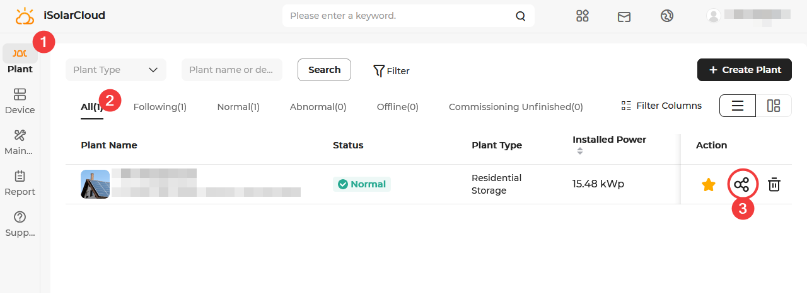
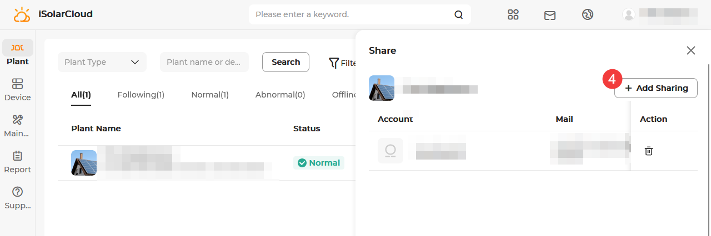
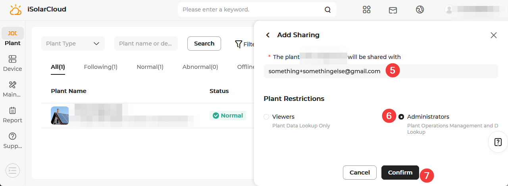

# Create an iSolarCloud account with installer privileges

## **⚠️ WARNING ⚠️**

**Installer accounts grant access to settings that should not be changed without knowing exactly what you are doing!**

**It also grants access to settings that should not be changed even if you know exactly what you are doing!**

**Stick to what you know. _If you don't know it - don't touch it._ You have been warned.**

## Step-by-step guide

1. Go to https://web3.isolarcloud.eu/ (or the appropriate page for your region) and register a new account, pick the installer role.
1. You can leave the company name empty or just put your name as your company or whatever.
1. After entering an email address, click on "send" next to "Verification code", check your email, and put the code in the field.
1. You need to use a different email address than your customer account. If you're using GMail, it's easy to use its alias feature for this. If your email is someone@gmail.com, you could use someone+installer@gmail.com, for example.
1. Once your new account is set up, log into iSolarCloud with your previous, customer-level account.
1. Go to the list of plants, click the share symbol next to your plant.
1. Click on "Add Sharing". Enter the email address you used for your installer account. Pick "Administrators".
1. Log out of your customer account, log into your installer account. You should have full access to your plant now.

<figure>
  
  <figcaption>isolarcloud steps 1-3</figcaption>
</figure>

<figure>
  
  <figcaption>SHxRT LAN connection</figcaption>
  <figcaption>isolarcloud step4</figcaption>
</figure>

<figure>
  
  <figcaption>isolarcloud steps 5-7</figcaption>
</figure>
